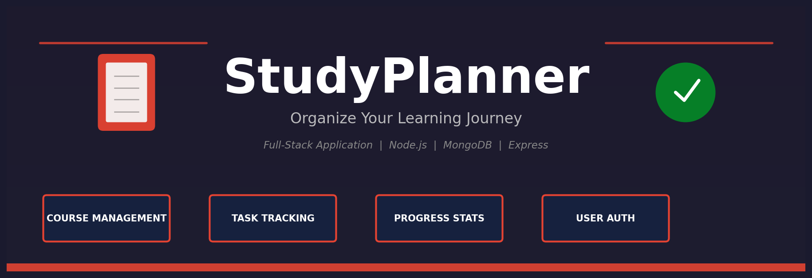

# StudyPlanner

## Proje Hakkında

**Proje Tanımı:**

StudyPlanner, öğrencilerin ve öğrenme tutkunlarının ders çalışma süreçlerini daha düzenli, verimli ve takip edilebilir hale getirmek amacıyla geliştirilmiş modern bir çalışma planlama ve görev yönetim platformudur. Kullanıcıların dijital ortamda kendi eğitim dünyalarını oluşturabilecekleri, derslerini ve görevlerini yönetebilecekleri ve gelişimlerini takip edebilecekleri bir yapı sunar.

Uygulama, sade ve kullanıcı dostu arayüzü ile Todoist'ten ilham alan tasarımı sayesinde derslerin ve görevlerin kolayca eklenmesini, görüntülenmesini ve düzenlenmesini mümkün kılar. Kullanıcılar sistem üzerinde kendi kurslarını oluşturabilir, her kurs altında görevler ekleyebilir ve tüm işlemler güvenli bir kullanıcı yönetim sistemi üzerinden gerçekleştirilir.

StudyPlanner'ın en önemli özelliklerinden biri, kapsamlı ilerleme takip sistemidir. Sistem, kullanıcıların tamamladığı ve bekleyen görevlerini analiz ederek her kurs için tamamlama yüzdeleri hesaplar, genel istatistikler sunar ve çalışma alışkanlıkları hakkında görsel geri bildirimler sağlar. Böylece kullanıcılar yalnızca görev takibi yapmakla kalmaz, aynı zamanda akademik gelişimleri hakkında bilinçli değerlendirmeler alırlar.

Modern yazılım mimarisi ve REST API tabanlı altyapısı sayesinde StudyPlanner, ölçeklenebilir ve geliştirilebilir bir sistem olarak tasarlanmıştır. Uygulamanın temel amacı, ders çalışmayı dijital ortamda daha organize, motive edici ve verimli bir deneyime dönüştürmektir.

StudyPlanner, kullanıcıların öğrenme yolculuğunu destekleyen yenilikçi bir platform olmayı hedeflemektedir. 📚✅

**Proje Kategorisi:**
Eğitim Teknolojileri (EdTech)

**Referans Uygulama:**
[Örnek Referans Uygulama](https://todoist.com)

---

## Proje Linkleri

- **REST API Adresi:** [https://studyplanner-2udh.onrender.com](https://studyplanner-2udh.onrender.com)
- **Web Frontend Adresi:** [https://study-planner-nine-fawn.vercel.app](https://study-planner-nine-fawn.vercel.app)

---

## Proje Ekibi

**Grup Adı:**
SoloDev

**Ekip Üyeleri:**
- Ahmad Alrifai

---

## Özellikler

StudyPlanner aşağıdaki temel özellikleri sunar:

### Kullanıcı Yönetimi
- ✅ Kullanıcı kaydı (Register)
- ✅ Kullanıcı girişi (Login)
- ✅ Kullanıcı çıkışı (Logout)
- ✅ JWT tabanlı kimlik doğrulama

### Kurs Yönetimi
- ✅ Kurs oluşturma
- ✅ Kursları listeleme
- ✅ Kurs güncelleme
- ✅ Kurs silme (ilişkili görevlerle birlikte)

### Görev Yönetimi
- ✅ Görev oluşturma (deadline ile)
- ✅ Görevleri listeleme
- ✅ Görev güncelleme
- ✅ Görev silme
- ✅ Görev tamamlama/toggle

### İstatistikler ve Filtreleme
- ✅ Görev filtreleme (tamamlanan/bekleyen)
- ✅ Kurs bazlı ilerleme istatistikleri
- ✅ Genel tamamlama oranları
- ✅ Görsel ilerleme çubukları

---

## Teknolojiler

| Katman | Teknolojiler |
|--------|-------------|
| **Backend** | Node.js, Express.js, MongoDB, Mongoose |
| **Frontend** | HTML5, CSS3, Vanilla JavaScript |
| **Veritabanı** | MongoDB Atlas (AWS Frankfurt) |
| **Deployment** | Render (Backend), Vercel (Frontend) |
| **Kimlik Doğrulama** | JWT (JSON Web Tokens), bcryptjs |

---

## API Endpoints

Tüm API endpoint'leri `/api` prefix'i ile başlar:

### Kimlik Doğrulama
| Metod | Endpoint | Açıklama |
|-------|----------|----------|
| POST | `/api/auth/register` | Yeni kullanıcı kaydı |
| POST | `/api/auth/login` | Kullanıcı girişi |
| POST | `/api/auth/logout` | Kullanıcı çıkışı |

### Kurslar
| Metod | Endpoint | Açıklama |
|-------|----------|----------|
| GET | `/api/courses` | Tüm kursları listele |
| POST | `/api/courses` | Yeni kurs oluştur |
| PUT | `/api/courses/:id` | Kurs güncelle |
| DELETE | `/api/courses/:id` | Kurs sil |

### Görevler
| Metod | Endpoint | Açıklama |
|-------|----------|----------|
| GET | `/api/tasks` | Görevleri listele |
| POST | `/api/tasks` | Yeni görev oluştur |
| PUT | `/api/tasks/:id` | Görev güncelle |
| DELETE | `/api/tasks/:id` | Görev sil |
| PUT | `/api/tasks/:id/complete` | Görevi tamamla |
| PUT | `/api/tasks/:id/toggle` | Görev durumunu değiştir |

### İstatistikler
| Metod | Endpoint | Açıklama |
|-------|----------|----------|
| GET | `/api/statistics` | Genel istatistikler |
| GET | `/api/statistics/quick` | Hızlı özet |
| GET | `/api/tasks/filter` | Görev filtreleme |
